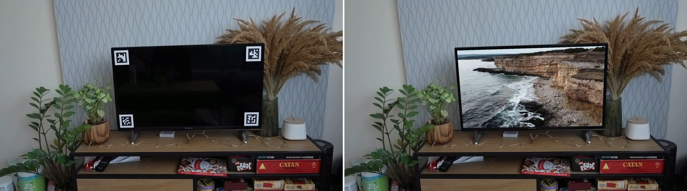
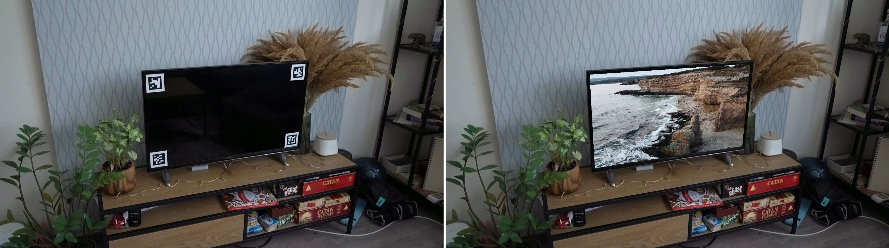
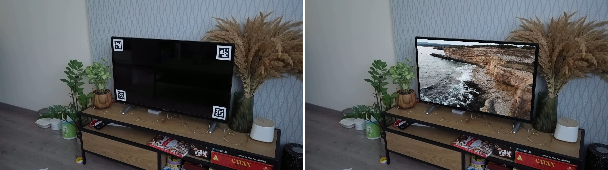

# Augmented Reality with ArUco Markers and Homography in OpenCV

## Overview

This Jupyter Notebook project demonstrates ArUco marker detection in a scene and performs Augmented Reality (AR) by replacing the detected region with another video using Homography transformations.

## Results

